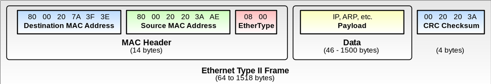

# ARP covert channel attacks by 8bit microcomputer

# Overview
Introduces a method of embedding information in the padding part of ARP and performing secret communication with only one small 8-bit microcomputer. The transmitter uses an 8-bit microcomputer called Atmega328P. A 10BASE-T Ethernet frame is generated using only the GPIO of the microcomputer without using a dedicated chip such as an Ethernet controller. By using this method, it is possible to perform a covert channel attack with a smaller and cheaper method than the conventional method.
Since this attack can be performed with a single inexpensive and small microcomputer, it can be hidden and operated inside devices that can be connected to various networks. 

# Keywords
- ARP & ARP padding
- Ethernet
- 10BASE-T
- Manchester encoding
- Atmag328P (Arduino)
- Replace crystal to 20MHz
- GPIO, Instruction set
- Tools (Windows) that I made.
    - calcrc
    - little
    - Packet2ino
- ArduinoIDE
- wireshark  // Packet analyzer

# Ethernet frame

Should be change EtherType to 0806 for ARP packet

# ARP Packet format

# ARP Packet format example

~~~
ffffffff ffffAA01 23456789 0806			<- Ethernet Header
00010800 06040001 00012345 6789c0a8 	<- ARP Packet
0a010000 00000000 c0a80a02
00000000 00000000 00000000 00000000 	<- Padding
0000
~~~

According to the Ethernet standard, ARP packets are too small, so padding increases the size.
Embed the secret data in this padding.

# Preamble

~~~
55 55 55 55 55 55 55 D5 Hex (bit sequence is little endian) 
~~~
In front of the Ethernet frame, an 8-byte (64-bit) signal called a preamble is added. This is used by the receiving side to synchronize the Ethernet frame. The preamble itself is a sequence of repeating 1s and 0s, but if you find 10101011 (5D) at the end of the preamble, it means that the beginning of the Ethernet Frame comes next. 
SFD（Start Frame Delimiter）

# FCS(Frame Check Sequence) 

After the Ethernet frame, it should be added Frame Check Sequence(FCS).
FCS is 4-octet field for detecting frame errors. CRC calculated value of each field of Ethernet frame.

# Manchester Encoding

In the case of 10Base-T, even if the transfer rate is 10 Mbps, Manchester encoding is applied, so a 20 MHz clock is required

# Arduino (Atmega328)

------------------------  
|Description |Data (should be done this table)
----|----
| Architecture| AVR|   
| Operating Voltage | 5V|

# Schematic

# Replace crystal to 20MHz

# Replace crystal to 20MHz on Youtube

https://www.youtube.com/watch?v=8uvN4Xv7P_U

# workshop
From here, I will explain how to send ARP only with Atmega328 using some tools. 
The operating environment is Windows.

# Editing an ARP Packet
~~~
ffffffff ffffAA01 23456789 08060001
08000604 00010001 23456789 c0a80a01
00000000 0000c0a8 0a020000 00000000
00000000 00000000 00000000
~~~

Edit the APR packet in Hex text using a text editor. The part in red is the padding part. Edit this part and write secret data. The file name is arpAA.txt.

# FCS calcuration
~~~
>type arpAA.txt

ffffffff ffffAA01 23456789 08060001
08000604 00010001 23456789 c0a80a01
00000000 0000c0a8 0a020000 00000000
00000000 00000000 00000000

>calcrc < arpAA.txt
0A 7E 64 F6
~~~
Calculate FCS using calcrc. Assign the previously edited file to standard input. 
The calculated FCS value is 0A 7E 64 F6.

# Adding preamble and FCS

~~~
55 55 55 55 55 55 55 D5
ffffffff ffffAA01 23456789 08060001
08000604 00010001 23456789 c0a80a01
00000000 0000c0a8 0a020000 00000000
00000000 00000000 00000000　
0A 7E 64 F6
~~~
Save as arpAA.frm

# Sending an Ethernet frame using only the Arduino IDE
since we changed the crystal to 20MHz, we need to change the Arduino's board.txt file.
you have to add following text to the board.txt

~~~
###################################################
botchip.name=botchip
botchip.upload.tool=avrdude
botchip.upload.protocol=arduino
botchip.bootloader.tool=avrdude
nano.bootloader.unlock_bits=0x3F
nano.bootloader.lock_bits=0x0F
botchip.build.f_cpu=16000000L
botchip.build.board=AVR_NANO
botchip.build.core=arduino
botchip.build.variant=eightanaloginputs
botchip.menu.cpu.atmega328old=botchip (Old Bootloader 20MHz)
botchip.menu.cpu.atmega328old.upload.maximum_size=30720
botchip.menu.cpu.atmega328old.upload.maximum_data_size=2048
botchip.menu.cpu.atmega328old.upload.speed=72000
botchip.menu.cpu.atmega328old.bootloader.low_fuses=0xFF
botchip.menu.cpu.atmega328old.bootloader.high_fuses=0xDA
botchip.menu.cpu.atmega328old.bootloader.extended_fuses=0xFD
botchip.menu.cpu.atmega328old.bootloader.file=atmega/ATmegaBOOT_168_atmega328.hex
botchip.menu.cpu.atmega328old.build.mcu=atmega328p
~~~

# packet2ino

~~~
C:\Users\imaoca09\OneDrive\source\packet2asm\packet2ino\Debug>little < dash.frm | packet2ino dash > dash.ino

~~~

# Arduino IDE Ino and Scketch

# Actual board

# Actual check with Wireshark

# Enjoy “ARP covert channel attacks by 8bit Microcomputer” by your hands. 

# Thank you.
